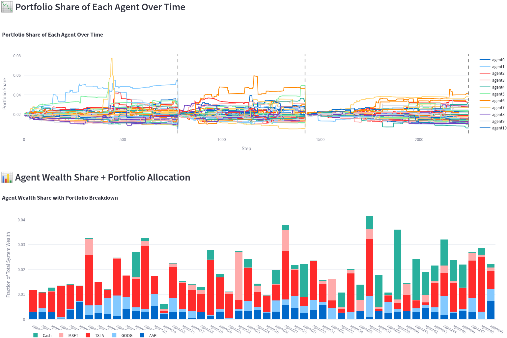

# Zero-Sum Closed Market Simulation Environment for Multi-Agent Reinforcement Learning with Self-Play

This repository provides a framework for simulating market environments where multiple agents engage in self-play trading using reinforcement learning (RL). The environment is based on a continuous double auction (CDA) model, allowing agents to place buy and sell orders, interact with a limit order book (LOB), and learn optimal trading strategies through self-play.

## Features

- **Continuous Double Auction (CDA) Environment**: Simulates a market where agents can place limit orders and interact with the LOB.
- **Multi-Agent Reinforcement Learning (MARL)**: Supports training of multiple agents using RL algorithms.
- **Zero-Sum Game Setup**: Agents compete in a zero-sum environment, where the gain of one agent is the loss of another.
- **Modular Design**: Easily extendable components for agents, environment, and training loops.

## Portfolio Performance and Agent Wealth Analysis

The following visualizations show the performance of multiple agents within the market environment:

1. **Portfolio Share of Each Agent Over Time**: This plot shows how the portfolio share of each agent evolves over time. Each agent’s portfolio share fluctuates based on their trading decisions in the environment, with some agents outperforming others as the simulation progresses.

2. **Agent Wealth Share + Portfolio Allocation**: The stacked bar chart illustrates the wealth distribution of each agent within the market, including their portfolio allocation. This visualization highlights how agents adjust their investments in different assets to optimize their overall wealth.



## File Structure

```plaintext
market-self-play/
│
├── trading_env.py      # Defines the trading environment
├── rl_training.py      # Contains the RL agent and training loop
├── state.py            # Manages the state representation
├── main.py             # Entry point for running the simulation
└── README.md           # Project documentation
